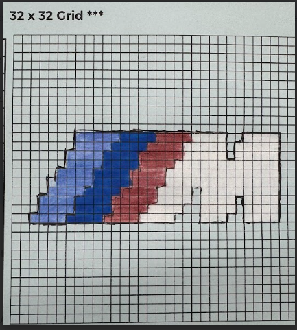
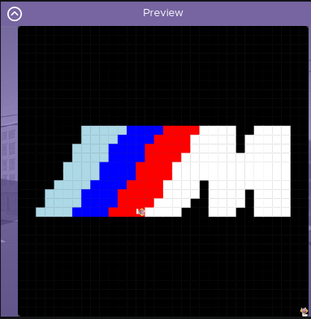

# Unit 1 - Asphalt Art

## Introduction

Cities use asphalt art to improve public safety, inspire their residents and visitors, and brighten communities. Your goal is to create asphalt art to revitalize The Neighborhood and bring the community together with the help of the Painter.

## Requirements

Use your knowledge of object-oriented programming, algorithms, the problem solving process, and decomposition strategies to create asphalt art:
- **Create a new subclass** – Create at least one new subclass of the PainterPlus class that is used for a component of the asphalt art design.
- **Plan an algorithm** – Use the problem solving process and decomposition strategies to plan an algorithm that incorporates a combination of sequencing, selection, and/or iteration.
- **Write a method** – Write at least one method in a PainterPlus subclass that contributes to a component of the asphalt art design.
- **Document your code** – Use comments to explain the purpose of the methods and code segments.

## Notes: Neighborhood & Painter Class

This project was created on Code.org's JavaLab platform using the built in Neightborhood GUI output. To test and edit this project you must build in Code.org's JavaLab with the Neighborhood GUI enabled. For reference to the Painter class documentation, [you can read more here.](https://studio.code.org/docs/ide/javalab/classes/Painter)

## Output: 
Sketch:

Final Image:

## Reflection

1. Describe your project.

   - My project paints a black background, and paints the BMW M performance logo in the center. I used the code.org 32x32 grid and the code.org MuralPainter and Painter class. I used the PainterPlus class written by me. I also made an MPainter class, that actually paints the logo.

2. What are two things about your project that you are proud of?

   - I am proud that I was able to do this on a 32x32 grid, where I would need to write a lot of code to make the logo, I also had to modify the MuralPainter class paintLine method to work with 32x32 grid / infinite paint. The second thing I was proud of was being able to take a photo of the M logo and use a website to pixelate the logo to the correct scale, so that I would be able to make it work on code.org.

3. Describe something you would improve or do differently if you had an opportunity to change something about your project.

   - Something I would do different is the logo. I would choose a more difficult logo, like AMG, where letters are more difficult to make than the stripes in the M logo. If I had the option I would also use a bigger grid, so I can make my logo look more refined.